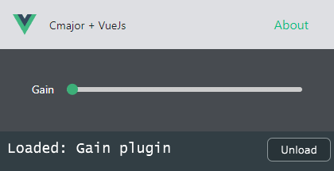

# Cmajor + Vue.js



Proof of concept [cmajor] gain fx patch with [vuejs] gui.

To test the patch simply run `npm install` and `npm run build`. Afterward drag the .cmajorpatch from
the dist directory to the cmaj-plugin within your daw or play the patch via the cmaj command line tool.

For development use `npm run build-dev` to rebuild the patch on change.

Tested with Cmajor Version: 1.0.2358 running the cmaj-plugin in Bitwig v5.1.6 on Windows 10.

#### Known issues / future improvements

- currently running the patch via the vscode extension does not seem to work
- when loading a patch the default values don't seem to be reflected inside the host

#### 🔊 [Spotify] / [Apple Music] / [Bandcamp] / [Soundcloud]

[cmajor]: https://github.com/cmajor-lang/cmajor
[vuejs]: https://vuejs.org/
[Spotify]: https://open.spotify.com/artist/2jOQrKX3rRoZORPfFcXaYU
[Apple Music]: https://music.apple.com/us/artist/loowps/1326334750
[Bandcamp]: https://loowps.bandcamp.com
[Soundcloud]: https://soundcloud.com/loowps


This template should help get you started developing with Vue 3 in Vite.

## Recommended IDE Setup

[VSCode](https://code.visualstudio.com/) + [Volar](https://marketplace.visualstudio.com/items?itemName=Vue.volar) (and disable Vetur).

## Type Support for `.vue` Imports in TS

TypeScript cannot handle type information for `.vue` imports by default, so we replace the `tsc` CLI with `vue-tsc` for type checking. In editors, we need [Volar](https://marketplace.visualstudio.com/items?itemName=Vue.volar) to make the TypeScript language service aware of `.vue` types.

## Customize configuration

See [Vite Configuration Reference](https://vitejs.dev/config/).

## Project Setup

```sh
npm install
```

### Compile and Hot-Reload for Development

```sh
npm run dev
```

### Type-Check, Compile and Minify for Production

```sh
npm run build
```

### Run Unit Tests with [Vitest](https://vitest.dev/)

```sh
npm run test:unit
```

### Run End-to-End Tests with [Playwright](https://playwright.dev)

```sh
# Install browsers for the first run
npx playwright install

# When testing on CI, must build the project first
npm run build

# Runs the end-to-end tests
npm run test:e2e
# Runs the tests only on Chromium
npm run test:e2e -- --project=chromium
# Runs the tests of a specific file
npm run test:e2e -- tests/example.spec.ts
# Runs the tests in debug mode
npm run test:e2e -- --debug
```

### Lint with [ESLint](https://eslint.org/)

```sh
npm run lint
```
