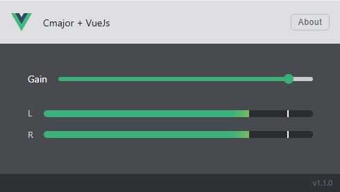

# Cmajor + Vue.js



Proof of concept [cmajor] gain fx patch with [vuejs] gui.

To test the patch simply run `pnpm install` and `pnpm run build`. Afterward drag the .cmajorpatch from
the dist directory to the cmaj-plugin within your daw or play the patch via the cmaj command line tool.

For development use `pnpm run build-dev` to rebuild the patch on change.

Tested with Cmajor Version: 1.0.2944 running the cmaj-plugin in Bitwig v6 on Windows 11.

#### Building a CLAP plugin

The [CLAP] headers are not part of cmajor, so clone them once next to this project:

```
git clone --depth 1 https://github.com/free-audio/clap.git ../clap
```

`pnpm run build-clap` then builds the ui and generates a self-contained CLAP plugin project into `dist-clap`,
with the include path to the CLAP headers already baked into its CMakeLists (the Vue gui is embedded into
the generated C++). Open that folder in your IDE, or build it from the command line:

```
cmake -S dist-clap -B dist-clap/build
cmake --build dist-clap/build --config Release
```

#### Known issues / future improvements

- currently running the patch via the vscode extension does not seem to work
- when loading a patch the default values don't seem to be reflected inside the host

#### 🔊 [Spotify] / [Apple Music] / [Bandcamp] / [Soundcloud]

[CLAP]: https://github.com/free-audio/clap
[cmajor]: https://github.com/cmajor-lang/cmajor
[vuejs]: https://vuejs.org/
[Spotify]: https://open.spotify.com/artist/2jOQrKX3rRoZORPfFcXaYU
[Apple Music]: https://music.apple.com/us/artist/loowps/1326334750
[Bandcamp]: https://loowps.bandcamp.com
[Soundcloud]: https://soundcloud.com/loowps
